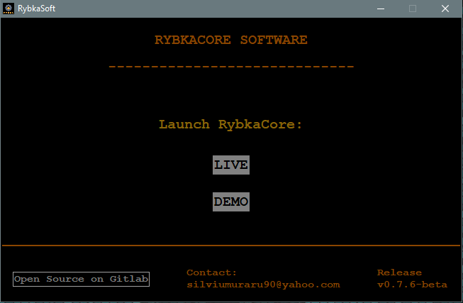

# 💱 RybkaCore

<div align="center">
  
</div>


<br>

## &emsp;&emsp; **Description**
<br>
📌 `RybkaCore` bot is a scalping crypto-trading-bot that currently supports the following pair(s):<br><br>
&emsp;&emsp;✅ `EGLD`-`USDT` <br><br><br>

📌 It uses 🔌 socket connection to Binance via the `unicorn-binance-suite` lib <br><br>

📌 It is a cross-OS software that has been tested on: <br><br>
&emsp;&emsp;✅ Ubuntu 18.04 (`Bionic Beaver`) <br>
&emsp;&emsp;✅ Ubuntu 20.04 (`Focal Fossa`) <br>
&emsp;&emsp;✅ Ubuntu 22.04 (`Jammy Jellyfish`) <br>
&emsp;&emsp;✅ Debian 10 (`buster`) <br>

&emsp;&emsp;✅ Win 10 <br>
&emsp;&emsp;✅ Win 11 <br>

&emsp;&emsp;❔ &nbsp;Mac OS <br><br>


> **Legend:** &emsp; ❔ &nbsp; ⟹ &nbsp; _not tested yet_


<br><br>

***

## &emsp;&emsp; **Features supported**
<br>

> ✅ Automated technical analysis (scalping mode) (based on a relative strength index - RSI) <br>
✅ Add-on in case of network failures, local software failures that will restart the bot. If internet drops and it restarts, it will always grab back the work from where it left it <br>
✅ Supports a `LIVE` MODE with connection to the actual Binance wallet of the user, as well as a `DEMO` MODE of the product, with fake data of a virtualized wallet <br>
✅ Creates separate local logs, considering the MODE the bot is in and tracks those independently of each other across multiple runs <br>
✅ Regular back-ups of important files <br>
✅ Individual buy tracking <br>
✅ Error catch mechanism and exception management <br>
✅ Uptime tracking <br>
✅ CLI-initiated / Telegram-initiated / GUI-initiated start <br>
✅ Some weights can be set from ENV, others from an `env_var_config` file. This gives possibility for some vars to be updated on the fly, while the bot is running and alter its behavior <br>
✅ CLI args for `RYBKA_MODE` values, to avoid faulty runs if `RYBKA_MODE` was to remain cached from ENV, even after the user had previously changed it <br>
✅ Email notif. module. Informs the user about being low on BNB, or on USDT, or if an error occured and bot got a shutdown. Also sends emails on start / restart actions <br>
✅ Dynamic adjustment (greediness) for buy-sell math of the trading pair <br>
✅ Live wallet data displayed for the trade pair sides and commission, dynamic adjustment with each buy - sell <br>
✅ Folder creation (timestamp included) with files containing important data of the current run and auto-archive system once the run is finished <br>
✅ Make bot sell multiple bought crypto-coins at once, if signal allows it (dynamically) <br>
✅ Upscale the trading quantity if user set it too low, so low that it hits the minimum 10💲 lower limit Binance imposed for a buy action <br>
✅ Clear profit tracked in time <br>
✅ Nr. of buy trades tracked in time <br>
✅ Colored log output based on log-level types (INFO, WARN, FATAL and DEBUG / VERBOSE / HIGH_VERBOSITY) <br>
✅ Timestamp added on bot's actions - logs, back-ups, trades, etc <br>
✅ Cross-OS support (Win / Linux-based) <br>
✅ Checks which amount of the USDT is locked (in limit / stop orders, etc.) and avoids using it <br>
✅ Local files check-up on each start / restart action, even integrity check for files' values <br>
✅ Telegram notifier (passive mode) <br>
✅ Telegram listener (interactive mode) <br>
✅ Controls the resulted `output files`' size
✅ Implementation of an `always buy` policy in which it will always buy when the price goes up and has nothing / close to nothing to sell for a better profitability over the same timeframe & graph positioning of the currency-to-stable-coin raport <br>
✅ `Safety net` implementation for USDT <br>


<br><br>

***

## &emsp;&emsp; **Prerequisites**
<br>
As `rybka` is not a standalone executable software yet, for any of the aforementioned OS listed, it manages to achieve cross-OS status directly via `python`. Currently compatible python versions: <br><br>
&emsp;&emsp;✅ Python 3.6 <br>
&emsp;&emsp;✅ Python 3.7 <br>
&emsp;&emsp;✅ Python 3.8 <br>
&emsp;&emsp;✅ Python 3.9 <br>
&emsp;&emsp;✅ Python 3.10 <br><br><br>

Hence, at the moment, you will need 🐍 `python` in your OS to run the software. Via `pip`, some modules would then come on top of your on-prem python installation: <br><br>
&emsp;&emsp;✅ python-binance <br>
&emsp;&emsp;✅ websocket-client <br>
&emsp;&emsp;✅ colored <br>
&emsp;&emsp;✅ click <br>
&emsp;&emsp;✅ requests <br>
&emsp;&emsp;✅ numpy <br>
&emsp;&emsp;✅ GPUtil <br>
&emsp;&emsp;✅ psutil <br>
&emsp;&emsp;✅ telepot <br>
&emsp;&emsp;✅ termcolor <br>
&emsp;&emsp;✅ python-telegram-bot==13.14 <br>
&emsp;&emsp;✅ unicorn-binance-suite (via `python3 -m pip install unicorn-binance-suite --upgrade --force-reinstall`) <br>
&emsp;&emsp;✅ TA-Lib <br><br><br>

❗️ `Note:` while via `pip3` you are able to install the first modules, `TA-Lib` is not currently available to be installed from the official `pypi` list, hence you can download the `wheel` file that matches your `python` version and then install it via `pip`. <br> Grab the file from 📦 [HERE](https://www.lfd.uci.edu/~gohlke/pythonlibs/#ta-lib) <br><br>
OR <br><br>
📦 Build it from source via Linux / Windows's `WSL` with these commands and then install it in the same way, via `pip`. Commands:
```
wget https://artiya4u.keybase.pub/TA-lib/ta-lib-0.4.0-src.tar.gz
tar -xvf ta-lib-0.4.0-src.tar.gz
cd ta-lib/ && \
ls -alH && \
chmod +x configure && \
./configure --build=x86_64-unknown-linux-gnu && \
make && \
sudo make install
```
<br>

❗️ `Note:` bot currently requires admin-level access on Windows in order to run, for it to be able to constantly synchronize the time with NIST's `time.nist.gov` server. This is NOT applicable for Linux-based distributions, where the de-sync issue has not been noticed

<br><br>

***

## &emsp;&emsp; **Getting started**
<br>

To run the software, beside the `prerequisites`, you will also need: <br><br>

🔘 Some `ENV` variables set: <br>

| VARIABLE | TYPE | DESCRIPTION | MANDATORY OR NOT | DEFAULT VALUE | 
|:-------------------------------------------|:------:|:------:|:----------------------------------------------------------------------------------:| :--------:|
|`RYBKA_PYTHON_PATH`                      | `string` | The absolute path to the `python.exe` that contains the libraries listed in this `readme.md` for running the software.<br><br>Note that this is only needed for GUI-initiated flows and `RybkaSoft` executable file(s) will run under system's python installation <br><br> (Get from environment)                           | ✅ <br> Only for GUI-initiated flows <br>(`RybkaSoft` binary file(s))        | ❌ | 
|`RYBKA_DEBUG_LVL`                      | `integer` | Values ➡️ `1`, `2` or `3`,<br>otherwise leave it `blank`<br><br>1️⃣ ➜ <b>Debug</b> &emsp; &emsp; &emsp;&nbsp;<br> 2️⃣ ➜ <b>Verbose</b> &emsp; &emsp; &nbsp;&nbsp; <br> 3️⃣ ➜ <b>High Verbosity</b><br> <br>(Get from config file)                           | ❌        | ❌ | 
|`RYBKA_TRADING_BOOST_LVL`                      | `integer` | Values ➡️ `1`, `2`, `3`, `4` or `5` <br>&emsp;<br>1️⃣ ➜ <b>Less</b> &emsp;<br>... <br>\<greediness\><br>...<br>5️⃣ ➜ <b>More</b><br> <br>(Get from environment / config file)                           | ✅        | `2` | 
|`RYBKA_MODE`                           | `string` | Values ➡️ `DEMO` or `LIVE` <br> <br>(Get from cli args)                           | ✅        | ❌ | 
|`BIN_KEY`                              | `string` | Binance <b>Auth</b>orization <b>KEY</b> <br> <br>(Get from environment)                            | ✅ <br> if `RYBKA_MODE` is either `LIVE` or `DEMO`        | ❌ | 
|`BIN_SECRET`                           | `string` | Binance <b>Auth</b>orization <b>SECRET</b> <br> <br>(Get from environment)                           | ✅ <br> if `RYBKA_MODE` is either `LIVE` or `DEMO`      | ❌ | 
|`RYBKA_RSI_FOR_BUY`                     | `integer` | <b>RSI threshold for BUY</b> actions <br> Values ➡️ (`0` ↔️ `50`) <br> The higher the value, the more sensitive the bot on buy actions <br> <br>(Get from config file)                           | ✅        | `30` | 
|`RYBKA_RSI_FOR_SELL`                    | `integer` | <b>RSI threshold for SELL</b> actions <br><br> Values ➡️ (`50` ↔️ `100`)<br> <br> The lower the value, the more sensitive the bot on sell actions <br> <br>(Get from config file)                           | ✅        | `70` | 
|`RYBKA_RSI_PERIOD`                    | `integer` | <b>RSI period of time</b><br>upon which the bot will gather data and take 1 decision<br><br> Values ➡️ (`10` ↔️ `∞`) <br> <br>(Get from config file)                           | ✅        | `10` | 
|`RYBKA_TRADE_QUANTITY`                  | `float` with a minimum Binance-imposed requirement of `stepSize=2`<br><br>(no more than 2 decimals) | The <b>crypto-coin amount</b> to buy on each transaction <br> <br>(Get from config file)                           | ✅        | `0.1` | 
|`RYBKA_MIN_PROFIT`                      | `float` | The `USDT` <b>minimum profit</b>, per transaction, that allows a SELL signal to complete <br> <br>(Get from config file)                           | ✅        | `0.3` | 
|`RYBKA_USDT_SAFETY_NET`                      | `float` | The `USDT` <b>Binance amount</b> that you want the bot to NOT touch / use for buy actions <br> <br>`None`, here, means undefined in the `config.ini` file; case in which it will not apply anywhere and bot will try to use as much `USDT` as possible <br><br>(Get from config file)                           | ❌        | `None` | 
|`RYBKA_EMAIL_SWITCH`                    | `boolean` | Values ➡️ `True` or `False` <br><br> `True` will enable Email Notifications <br>`False` will disable them<br> <br>(Get from environment / config file)                           | ✅        | `False` | 
|`RYBKA_EMAIL_SENDER_EMAIL`              | `string` | <b>Email</b> for the account sending the email <br> <br>(Get from environment / config file)                           | ✅ <br> if `RYBKA_EMAIL_SWITCH` is `True`       | ❌ | 
|`RYBKA_EMAIL_SENDER_DEVICE_PASSWORD`    | `string` | <b>DEVICE password</b>, not the emailbox password, (tested only with @gmail.com accounts) of the account sending the email  <br> <br>(Get from environment)                           | ✅ <br> if `RYBKA_EMAIL_SWITCH` is `True`       | ❌ | 
|`RYBKA_EMAIL_RECIPIENT_EMAIL`           | `string` | <b>Email</b> for the account receiving the email <br> <br>(Get from environment / config file)                           | ✅ <br> if `RYBKA_EMAIL_SWITCH` is `True`        | ❌ | 
|`RYBKA_EMAIL_RECIPIENT_NAME`            | `string` | <b>Name</b> of the person receiving the email <br> <br>(Get from environment / config file)                           | ✅ <br> if `RYBKA_EMAIL_SWITCH` is `True`        | `User` | 
|`RYBKA_DISCLAIMER`                      | `boolean` | Values ➡️ `True` or `False` <br> <br> `True` will enable a Safety Disclaimer <br>`False` will disable it<br><br>(Get from environment / config file)                           | ✅        | `True` | 
|`RYBKA_DEMO_BALANCE_USDT`                      | `float` | Amount of `USDT` the bot is provided with, in `DEMO` mode <br> <br>(Get from config file)                           | ❌        | `1500` | 
|`RYBKA_DEMO_BALANCE_EGLD`                      | `float` | Amount of `EGLD` the bot is provided with, in `DEMO` mode <br> <br>(Get from config file)                           | ❌        | `100` | 
|`RYBKA_DEMO_BALANCE_BNB`                      | `float` | Amount of `BNB` the bot is provided with, in `DEMO` mode <br> <br>(Get from config file)                           | ❌        | `0.2` | 
|`RYBKA_TELEGRAM_SWITCH`                      | `boolean` | Values ➡️ `True` or `False` <br><br> `True` will enable Telegram Notifications <br>`False` will disable them<br> <br>(Get from environment / config file)                           | ✅        | `False` |  
|`RYBKA_TELEGRAM_API_KEY`                      | `string` | Telegram bot's <b>Auth</b>orization <b>KEY</b> <br> <br>(Get from environment)                           | ✅ <br> if `RYBKA_EMAIL_SWITCH` is `True`        | ❌ | 
|`RYBKA_TELEGRAM_CHAT_ID`                      | `string` | Telegram bot's chat <b>id</b>entificator <br> <br>(Get from environment)                           | ✅ <br> if `RYBKA_EMAIL_SWITCH` is `True`        | ❌ | 

<br>

🔘 Some `USDT` for buy actions in your Binance wallet <br><br>

🔘 Some `BNB` amount in your Binance wallet (this is the currency used for trades' commission; `~100 trades = 1$ commission`) <br><br>

🔘 And, of course, an `internet connection` <br><br><br>

### &emsp;&emsp;<b>Notes</b><br><br>
❗️ Note for the actual run of the software. You are `allowed` to run two instances of the bot in different parts of the system / different PCs (`one` in `DEMO` mode, `one` in `LIVE` mode and in different paths within the system / folders). You can even run `N` instances of `DEMO` bots or `1` x `LIVE` and `N` `DEMO` bots, but please:
<br><b>&emsp;&emsp;`Never` run more than `1` `LIVE` version of the bot, as it will corrupt each other's data!</b>
<br><br><br>
❗️ Note for the [`RYBKA_TELEGRAM_API_KEY`] var: For Telegram notifications, you'll need to create your own Telegram bot in the `Telegram` app. Simply search for `BotFather` among "Contacts", then type in that chat `/newbot` and follow instructions to create one and grab the API KEY that you need to set in your env as a value for the `RYBKA_TELEGRAM_API_KEY` var. <br><br><br>
❗️ Note for the [`RYBKA_TELEGRAM_CHAT_ID`] var: In order to grab this value go to this link: `https://api.telegram.org/bot<replace_with_your_value_for_RYBKA_TELEGRAM_API_KEY>/getUpdates`, then type something in the chat of your newly created bot (not in the same chat for `BotFather`!). The message you typed should be visible there as an API payload. Grab the value for the `RYBKA_TELEGRAM_CHAT_ID` var from there - find it within such structure `"chat":{"id":<your_chat_id_value>,`. Add it to the ENV.<br><br><br>
❗️ Notes for the [`BIN_KEY`] / [`BIN_SECRET`] vars: <br>

🔸 Opt out of Binance's `Default Security Controls` policy for their generated API Keys, if you don't want to have the API Key tied to your IP address in order to be able to give it permissions for `Spot & Margin Trading`. You will find the checkbox to be avoided while you will try to generate an API Key in Binance's GUI:

<div align="center">
  
</div>
<br>

🔸 Make sure to hit the checkbox in order to `Enable Spot & Margin Trading` after you have generated the `key` and `secret` in Binance. <b>Checkbox has to turn `yellow`</b>.<br>

<div align="center">
  
</div>
<br>

🔸 In Binance's GUI a white `tick` inside a black checkbox does not mean `checked`! Only a white `tick` on yellow background would mean enabled (as in the picture above). I know... confusing...

<br><br>

❗️ `Note:` Recommendation for having the best UI output - running `Rybka` software into a `cmd` shell within `Visual Studio Code` <br>
❗️ `Note:` Recommendation for having the best uptime (this includes opting out of Binance's `Default Security Controls` policy, to be sure your Public IP won't change, as unfortunately, Binance does NOT offer the variant of having a dynamic DNS, which would've solved this part otherwise) and better profit return (only due to low electricity cost) - running `Rybka` software on a `Raspberry PI 4` connected directly to a `UPS` <br>
<div align="center">
  
</div>
❗️ `Note:` Running the bot with higher trading quantities or lower will NOT mean the taxes - compared to your profits will vary, as tax is a percentage of the trading quantity moved around. Profit - taxes report can only be increased in your favor if you run the bot with a higher profit margin, per trade; <br><br><br>

> ▶️ For Win -> you can run directly the `RybkaSoft.exe` file and start the needed process(es) from that GUI; or via a CLI (no GUI presentation screen) with admin priviledges with `python rybka.py -m <mode>`. Mode is either of "demo" or "live". <br><br>
▶️ For Linux however -> you have to grant executable permissions via `chmod +x RybkaSoft` and then still run it via terminal with `./RybkaSoft` cmd, unfortunately, for it to boot correctly; or via a CLI (no GUI presentation screen) without sudo / root priviledges with `python rybka.py -m <mode>`. Mode is either of "demo" or "live". <br><br>
▶️ (Win / Linux) The Telegram Listener (Telegram interactive part) module (which is only the listener part where user can input commands and info. will be provided for each) is to be started by Rybka bot directly when it runs, as a subshell, without any user action.

<br><br>


***
***

# <center> **Let's have a sneak peek into it, shall we? 🖥** </center> 

## 🗃 Booting up the bot (logs during v.6.x.x-beta):

<div align="center">
  
</div>
<br>
<div align="center">
  
</div>
<br>
<div align="center">
  
</div>
<br><br>

## 🗃 Telegram Listener (interactive) module appearance in logs (logs during v.6.x.x-beta):

<div align="center">
  
</div>
<br><br>

## 🗃 Telegram logs on mobile (logs during v.6.x.x-beta):

<p align="center">
  
   
  
  
</p>

<br><br>
***
***

# <center> **More to know** </center> 


## 🟣 Contributors

If you are willing to have your stress level increased by: <br>
&emsp; ☢️ fixing the stuff in here <br>
&emsp; ☣️ optimizing those lines of code <br>
&emsp; 💡 coming up with bright ideas for new features <br>

=> Send me an email to `silviumuraru90@yahoo.com` and I'll consider your request.<br><br>


...but pay attention, the [BOARD-FOR-ROADMAP](https://gitlab.com/Silviu_space/rybka/-/boards) is full!

And the road is long and full of tERRORs!

<br>

***
## 🟣 
<br>

| 👨‍💼 `Silviu-Iulian Muraru` | Contact Data |
|:---------------------------------------:|:---------------|
||
||[](https://www.linkedin.com/in/silviu-muraru-iulian/)


<br>

***
## 🟣 [](https://gitlab.com/Silviu_space/rybka/-/blob/master/LICENSE)

<br>

***
## 🟣 [](https://gitlab.com/Silviu_space/rybka/-/boards)

| Release lifecycle phases | Current lifecycle phase | Estimated date(s) of `start` / `finish` |
|:--------------------------------|:---------------:|:-----------------------:|
&emsp;&emsp; ✔️ `ALPHA`              |                 | August 2022 (`finished`)
&emsp;&emsp; 💻 `BETA` / `BETA TESTING`              |        ✅       | September 2022 (`started`)
&emsp;&emsp; 💻 `RELEASE CANDIDATE`  |                 | ⬛️
&emsp;&emsp; 💻 `GA`                 |                 | ⬛️

<br>

***
## 🟣 [](https://gitlab.com/Silviu_space/rybka/-/boards)
<br>

<b>🔜 There are still some pieces to move:</b> <br>

&emsp;&emsp; ♛ &nbsp;`Price alerts`, via inputs <br>
&emsp;&emsp; ♘ &nbsp;`Graphs` provided as output in specific situations <br>
&emsp;&emsp; ♙ &nbsp;Additional `RSI` periods or `indexes`, for a better and broader view <br>
&emsp;&emsp; ♗ &nbsp;`Unit testing` + `coverage`, for a better integrity. Safer / quicker testing <br>


<br>

And, of course, `bug fixing` 🪓 <br><br><br><br><br>
<i>Happy trading!<br><br>
And remember...</i>
***
> `"TIME IN THE MARKET IS BETTER THAN TIMING THE MARKET!"` <b><i>- Kenneth Fisher</i></b><br>
