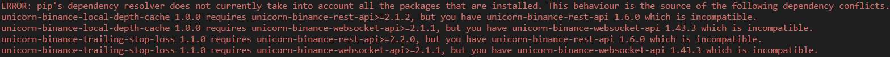

<div align="center">
  
</div>
<br><br>
<div align="center">
  
</div>


<br>

## &emsp;&emsp; **Description**
<br>
📌 `RybkaCore` bot is a scalping crypto-trading-bot that currently supports the following pair(s):<br><br>

&emsp;&emsp;✅ `EGLD` - `USDT` (tested, `default`) <br>
&emsp;&emsp;✅ `?` - `<stablecoin>` (experimental) 

<br>

> `Note:` You may use other trading pairs, as long as: <br><br>
 <b>1.</b> Their price in relative to the `stablecoin` side of the traing pair chosen is not a subunitary value and also is not expected to go on such a value level. <br>
 <b>2.</b> You do take notice this would be purely `experimental`, if you don't use the `default` pair in the meantime for good / stable results.<br>
 <b>3.</b> There is a valid trading pair forming as [`<cryptocoin><stablecoin>`] <br>
 <b>4.</b> There is a valid trading pair forming as [`BNB<stablecoin>`] (for fees)<br>
&emsp;&emsp;All Binance supported trade pair symbols are to be found here: [HERE](https://api.binance.com/api/v3/exchangeInfo)    -->   `"symbol":"<some_symbol>"`

<br><br>

📌 It uses 🔌 socket connection to Binance via the `unicorn-binance-suite` lib and does orders via `python-binance` lib<br><br>

📌 It is a cross-OS software that has been tested on: <br><br>
&emsp;&emsp;✅ Ubuntu 18.04 (`Bionic Beaver`) <br>
&emsp;&emsp;✅ Ubuntu 20.04 (`Focal Fossa`) <br>
&emsp;&emsp;✅ Ubuntu 22.04 (`Jammy Jellyfish`) <br>
&emsp;&emsp;✅ Debian 10 (`buster`) <br>

&emsp;&emsp;✅ Win 10 <br>
&emsp;&emsp;✅ Win 11 <br>

&emsp;&emsp;❔ &nbsp;Mac OS <br><br>


> **Legend:** &emsp; <br>❔ &nbsp; ⟹ &nbsp; _not tested yet_ <br><br> - Here, `cryptocoin` refers to the other half of the `stablecoin` trading pair you will use.<br>
&emsp;&emsp;&emsp;&emsp;Example: in the `EGLDUSDT` pair, the `cryptocoin` would be `EGLD`

<br><br>
⚠️ `DISCLAIMER`: Before moving on, please understand that `RybkaCore` bot was created in the spirit of making profits getting the best out of a `market volatility`. Still, this does `NOT` mean you can't lose money using it. `(1)` If you set up a lower amount of `[RYBKA_MIN_PROFIT]` than the one put in place, `(2)` if you use the bot in `bull market`, and then the price of the chosen `cryptocoin` in raport to the `stablecoin` drops dramatically and your coins remain bought very high on a price graph, rendering selling them highly unprofitable or `(3)` if unforeseen network / tech-related issues happen that somehow might make the bot behave unaccordingly to the purpose it was designed to, which is always being profitable for the user; or `(4)` if the `stablecoin` you use will experience a `depeg` event, silimar to what happened to USDT in the summer of 2023; or `(5)` any other situation I can't envision right now - then, in all of these cases, you might lose money (fiat / crypto). Yes, the bot is developed in good faith, but not everything can be predicted / dealt with;<br>
❗️ In any case, you also have to understand that while such `disclaimer` is necessary, I'm confident enought to use this bot in `LIVE` mode, for myself, hence I'm pretty confident in its inner workings. As it's `open-source` it can easily be audited. If you find bugs in it, I'm open to discuss them and eventually solve, just let me know via an email.

<br><br>

***
❗️ Keep your bot `up-to-date` for benefiting from the features below and bugs fixes along the way


***

## &emsp;&emsp; **Features supported**
<br>

> ✅ Automated technical analysis (scalping mode) (based on a relative strength index - RSI) <br>
✅ Add-on in case of network failures, local software failures that will restart the bot. If internet drops and it restarts, it will always grab back the work from where it left it <br>
✅ Supports a `LIVE` MODE with connection to the actual Binance wallet of the user, as well as a `DEMO` MODE of the product, with fake data of a virtualized wallet <br>
✅ Creates separate local logs, considering the MODE the bot is in and tracks those independently of each other across multiple runs <br>
✅ Regular back-ups of important files <br>
✅ Individual buy tracking <br>
✅ Error catch mechanism and exception management <br>
✅ Uptime tracking <br>
✅ CLI-initiated / Telegram-initiated / GUI-initiated start <br>
✅ Some weights can be set from ENV, others from an `env_var_config` file. This gives possibility for some vars to be updated on the fly, while the bot is running and alter its behavior <br>
✅ CLI args for `RYBKA_MODE` values, to avoid faulty runs if `RYBKA_MODE` was to remain cached from ENV, even after the user had previously changed it <br>
✅ Email notif. module. Informs the user about being low on BNB, or on stablecoin, or if an error occured and bot got a shutdown. Also sends emails on start / restart actions <br>
✅ Dynamic adjustment (greediness) for buy-sell math of the trading pair <br>
✅ Live wallet data displayed for the trade pair sides and commission, dynamic adjustment with each buy - sell <br>
✅ Folder creation (timestamp included) with files containing important data of the current run and auto-archive system once the run is finished <br>
✅ Make bot sell multiple bought crypto-coins at once, if signal allows it (dynamically) <br>
✅ Upscale the trading quantity if user set it too low, so low that it hits the minimum 10💲lower limit Binance imposed for a buy action <br>
✅ Clear profit tracked in time <br>
✅ Nr. of buy trades tracked in time <br>
✅ Colored log output based on log-level types (INFO, WARN, FATAL and DEBUG / VERBOSE / HIGH_VERBOSITY) <br>
✅ Timestamp added on bot's actions - logs, back-ups, trades, etc <br>
✅ Cross-OS support (Win / Linux-based) <br>
✅ Checks which amount of the stablecoin is locked (in limit / stop orders, etc.) and avoids using it <br>
✅ Local files check-up on each start / restart action, even integrity check for files' values <br>
✅ Telegram notifier (passive mode) <br>
✅ Telegram listener (interactive mode) <br>
✅ Controls the resulted `output files`' size
✅ Implementation of an `always buy` policy in which it will always buy when the price goes up and has nothing / close to nothing to sell for a better profitability over the same timeframe & graph positioning of the currency-to-stable-coin raport <br>
✅ `Safety net` implementation for the preferred stablecoin <br>
✅ Various `graphs` generated on the spot and provided via Telegram <br>
✅ When it remains without too much currency for trade fees (BNB) - it will automatically convert between 10 and 15 stablecoins into BNB. This, of course, doesn't take from the safety net of the stablecoin <br>
✅ Added a submode to allow only BUYs and no SELLs. Can be controlled via a weight and of course - remotely, via Telegram <br>
✅ Added a submode to allow only SELLs and no BUYs. Can be controlled via a weight and of course - remotely, via Telegram <br>


<br><br>

***

## &emsp;&emsp; **Prerequisites**
<br>
As `rybka` is not a standalone executable software yet, for any of the aforementioned OS listed, it manages to achieve cross-OS status directly via `python3`. Currently compatible python versions: <br><br>

&emsp;&emsp;✅ Python 3.6 <br>
&emsp;&emsp;✅ Python 3.7 <br>
&emsp;&emsp;✅ Python 3.8 <br>
&emsp;&emsp;✅ Python 3.9 <br>
&emsp;&emsp;✅ Python 3.10 <br>
&emsp;&emsp;✅ Python 3.11 (`3.11.9 is last one tested`)<br>
&emsp;&emsp;❌ Python 3.12 (`As of April 2024 - this version of python is identifying escape strings where there are just substring chars`)

<br><br>

Hence, at the moment, you will need 🐍 `python` in your OS to run the software. Via `pip`, some modules would then come on top of your on-prem python installation. Follow these steps: <br><br>

1. Install the majority of needed libs via:
```
pip install -r requirements.txt
```
<br>

2. Downsgrade subdeps of `unicorn-binance-suite`, to respect the `MIT License` of that version:
```
pip install unicorn-binance-trailing-stop-loss==1.1.0 unicorn-binance-websocket-api==1.43.3 unicorn-binance-local-depth-cache==1.0.0 unicorn-binance-rest-api==1.6.0
```
- And don't worry if you see something like this during the process, as long as it says it completed the installations successfully in the end:

<div align="center">
  
</div>

- I needed to impose such versioning limits in order to respect the MIT License [HERE](https://github.com/LUCIT-Systems-and-Development/unicorn-binance-websocket-api/blob/1.46.2/LICENSE)
- If you would like to use their latest version of the `unicorn-binance-suite` library, which by the way, I strongly recommend you to do, as they are doing some awesome work over there, grab their [latest version of the software (any 2.0.0)](https://github.com/LUCIT-Systems-and-Development/unicorn-binance-websocket-api/releases) and obtain a [license](https://shop.lucit.services/software/unicorn-binance-suite) for it. I'll leave [here](https://medium.lucit.tech/how-to-obtain-and-use-a-unicorn-binance-suite-license-key-and-run-the-ubs-module-according-to-best-87b0088124a8#4ca4) and article with a more in-depth perspective<br><br>


3. While via `pip3` you are able to install almost all of the modules, `TA-Lib` is not currently available to be installed from the official `pypi` list, hence you can download the `wheel` file that matches your `python` version and then install it via `pip`:

<br>

 📁 Grab the file from 📦 [HERE](https://github.com/cgohlke/talib-build/releases); <br>
 📁 For example: `TA_Lib-0.4.28-cp311-cp311-win_amd64.whl` will apply to Win's python v.3.11.x envs;<br> 
 📁 Then you can go in the dir where the `.whl` file downloaded, and `pip install <TA_Lib_file_name_you_downloaded>.whl` using `pip3` under the required python you previously used to install the other modules or within the `pyenv`'s py ver. / etc. you use for the bot
 
 <br>


❗️ `Note:` Bot currently requires admin-level access on Windows in order to run, for it to be able to constantly synchronize the time with NIST's `time.nist.gov` server. This is NOT applicable for Linux-based distributions, where the de-sync issue has not been noticed

<br>

❗️ `Note:` Usually, the Windows installation should go somewhat like this:<br>

&emsp;&emsp;&emsp;🔹`Chocolatey` module installation via `Powershell`:
```
Set-ExecutionPolicy Bypass -Scope Process -Force; [System.Net.ServicePointManager]::SecurityProtocol = [System.Net.ServicePointManager]::SecurityProtocol -bor 3072; iex ((New-Object System.Net.WebClient).DownloadString('https://community.chocolatey.org/install.ps1'))
```

&emsp;&emsp;&emsp;🔹`Pyenv` installation via `Chocolatey`:
```
choco install pyenv-win
```


&emsp;&emsp;&emsp;🔹`Python` installation via `Pyenv` versioning manager:
```
pyenv install --list       (to see the available py versions, run `pyenv update` for an updated DB)
pyenv install 3.<X>.<X>
pyenv global 3.<X>.<X>
```
<br><br>


***

## &emsp;&emsp; **Getting started (Installation)**
<br>

To run the software, beside the `prerequisites`, you will also need: <br><br>

🔘 Some `ENV` variables set: <br>

| VARIABLE | TYPE | DESCRIPTION & MORE INFO | MANDATORY OR NOT | DEFAULT VALUE | 
|:-------------------------------------------|:------:|:------:|:----------------------------------------------------------------------------------:| :--------:|
|`RYBKA_PYTHON_PATH`                      | `string` | `Desc`: The absolute path to the `python.exe` that contains the libraries listed in this `readme.md` for running the software.<br><br> `Note`: this is only needed for GUI-initiated flows and `RybkaSoft` executable file(s) will run under system's python installation <br><br> (Get from environment)                           | ✅ <br> Only for GUI-initiated flows <br>(`RybkaSoft` binary file(s))        | ❌ | 
|`RYBKA_DEBUG_LVL`                      | `integer` | `Desc`: Enable more logs to flow out of the bot in CLI or even in Telegram, if used in conjuction with `RYBKA_ALL_LOG_TLG_SWITCH` var <br><br>Values ➡️ `1`, `2` or `3`,<br>otherwise leave it `blank`<br><br>1️⃣ ➜ <b>Debug</b> &emsp; &emsp; &emsp;&nbsp;<br> 2️⃣ ➜ <b>Verbose</b> &emsp; &emsp; &nbsp;&nbsp; <br> 3️⃣ ➜ <b>High Verbosity</b><br> <br>(Get from config file)                           | ❌        | ❌ | 
|`RYBKA_ALLOW_ONLY_BUYS`                      | `integer` | `Desc`: Submode for bot to allow only BUYs and NO SELLs<br><br>Values ➡️ `0` or `1`<br> <br>(Get from environment / Get from config file)                           | ✅        | `0` | 
|`RYBKA_ALLOW_ONLY_SELLS`                      | `integer` | `Desc`: Submode for bot to allow only SELLs and NO BUYs<br><br>Values ➡️ `0` or `1`<br> <br>(Get from environment / Get from config file)                           | ✅        | `0` | 
|`RYBKA_TRADING_BOOST_LVL`                      | `integer` | `Desc`: Values ➡️ `1`, `2`, `3`, `4` or `5` <br>&emsp;<br>1️⃣ ➜ <b>Less</b> &emsp;<br>... <br>\<greediness\><br>...<br>5️⃣ ➜ <b>More</b><br> <br>(Get from environment / config file)                           | ✅        | `2` | 
|`RYBKA_MODE`                           | `string` | `Desc`: Main modes for bot (`LIVE` means orders with real money and a real wallet, while `DEMO` means orders with mere numbers representing money and a virtualized wallet)<br><br>Values ➡️ `DEMO` or `LIVE` <br> <br>(Get from cli args)                           | ✅        | ❌ | 
|`RYBKA_BIN_KEY`                              | `string` | `Desc`: Binance <b>Auth</b>orization <b>KEY</b> <br> <br>(Get from environment)                            | ✅ <br> if `RYBKA_MODE` is either `LIVE` or `DEMO`        | ❌ | 
|`RYBKA_BIN_SECRET`                           | `string` | `Desc`: Binance <b>Auth</b>orization <b>SECRET</b> <br> <br>(Get from environment)                           | ✅ <br> if `RYBKA_MODE` is either `LIVE` or `DEMO`      | ❌ | 
|`RYBKA_RSI_FOR_BUY`                     | `integer` | `Desc`: <b> RSI threshold value for BUY</b> actions <br><br> Values ➡️ (`0` ↔️ `50`) <br><br> The higher the value, the more sensitive the bot on buy actions <br><br> `Note`: Adding or subtracting `N` to / from the value of [`RYBKA_RSI_FOR_BUY`] var does <b>NOT</b> imply adding or subtracting the same `N` value from its relative [`RYBKA_RSI_FOR_SELL`] var <br> <br>(Get from config file)                           | ✅        | `30` | 
|`RYBKA_RSI_FOR_SELL`                    | `integer` | `Desc`: <b> RSI threshold value for SELL</b> actions <br><br> Values ➡️ (`50` ↔️ `100`)<br> <br> The lower the value, the more sensitive the bot on sell actions <br><br> `Note`: Adding or subtracting `N` to / from the value of [`RYBKA_RSI_FOR_SELL`] var does <b>NOT</b> imply adding or subtracting the same `N` value from its relative [`RYBKA_RSI_FOR_BUY`] var<br> <br>(Get from config file)                           | ✅        | `70` | 
|`RYBKA_RSI_PERIOD`                    | `integer` | `Desc`: <b> RSI period of time</b><br>upon which the bot will gather data and take 1 decision<br><br> Values ➡️ (`10` ↔️ `∞`) <br> <br>(Get from config file)                           | ✅        | `10` | 
|`RYBKA_TRADE_QUANTITY`                  | `float` with a minimum Binance-imposed requirement of `stepSize=2`<br><br>(no more than 2 decimals) | `Desc`: The <b>crypto-coin amount</b> to buy on each cryptocoin-stablecoin transaction <br> <br>(Get from config file)                           | ✅        | `0.1` | 
|`RYBKA_MIN_PROFIT`                      | `float` | `Desc`: The `stablecoin` <b>minimum profit</b>, per transaction, that allows a SELL signal to complete <br> <br>(Get from config file)                           | ✅        | `0.3` | 
|`RYBKA_STABLECOIN_SAFETY_NET`                      | `float` | `Desc`: The `stablecoin` <b> amount in your Binance wallet (the stablecoin within the chosen trading pair)</b> that you want the bot to NOT touch / use for buy actions <br><br>(Get from config file)                           | ❌        | `0` | 
|`RYBKA_EMAIL_SWITCH`                    | `boolean` | `Desc`: Enable / disable receiving important notifications via email<br><br>Values ➡️ `True` or `False` <br><br> `True` will enable Email Notifications <br>`False` will disable them<br> <br>(Get from environment / config file)                           | ✅        | `False` | 
|`RYBKA_EMAIL_SENDER_EMAIL`              | `string` | `Desc`: <b>Email address</b> of the account sending the email <br> <br>(Get from environment / config file)                           | ✅ <br> if `RYBKA_EMAIL_SWITCH` is `True`       | ❌ | 
|`RYBKA_EMAIL_SENDER_DEVICE_PASSWORD`    | `string` | `Desc`: <b>DEVICE password</b>, not the emailbox password, (tested only with @gmail.com accounts) of the account sending the email  <br> <br>(Get from environment)                           | ✅ <br> if `RYBKA_EMAIL_SWITCH` is `True`       | ❌ | 
|`RYBKA_EMAIL_RECIPIENT_EMAIL`           | `string` | `Desc`: <b>Email address</b> of the account receiving the email <br> <br>(Get from environment / config file)                           | ✅ <br> if `RYBKA_EMAIL_SWITCH` is `True`        | ❌ | 
|`RYBKA_EMAIL_RECIPIENT_NAME`            | `string` | `Desc`: <b>Name</b> of the person receiving the email <br> <br>(Get from environment / config file)                           | ✅ <br> if `RYBKA_EMAIL_SWITCH` is `True`        | `User` | 
|`RYBKA_DISCLAIMER`                      | `boolean` | `Desc`: Enable / disable viewing bot's disclaimer for its usage<br><br>Values ➡️ `True` or `False` <br> <br> `True` will enable a Safety Disclaimer <br>`False` will disable it<br><br>(Get from environment / config file)                           | ✅        | `True` | 
|`RYBKA_DEMO_BALANCE_STABLECOIN`                      | `float` | `Desc`: Amount of `stablecoin` the bot is provided with, in `DEMO` mode <br> <br>(Get from config file)                           | ❌        | `1500` | 
|`RYBKA_DEMO_BALANCE_CRYPTOCOIN`                      | `float` | `Desc`: Amount of `cryptocoin` the bot is provided with, in `DEMO` mode <br> <br>(Get from config file)                           | ❌        | `100` | 
|`RYBKA_DEMO_BALANCE_BNB`                      | `float` | `Desc`: Amount of `BNB` the bot is provided with, in `DEMO` mode <br> <br>(Get from config file)                           | ❌        | `0.2` | 
|`RYBKA_TELEGRAM_SWITCH`                      | `boolean` | `Desc`: Enable / disable receiving messages via Telegram<br><br>Values ➡️ `True` or `False` <br><br> `True` will enable Telegram Notifications <br>`False` will disable them<br> <br>(Get from environment / config file)                           | ✅        | `False` |  
|`RYBKA_TELEGRAM_API_KEY`                      | `string` | `Desc`: Bot's Telegram <b>Auth</b>orization <b>KEY</b> <br> <br>(Get from environment)                           | ✅ <br> if `RYBKA_EMAIL_SWITCH` is `True`        | ❌ | 
|`RYBKA_TELEGRAM_CHAT_ID`                      | `string` | `Desc`: Bot's Telegram chat <b>id</b>entificator <br> <br>(Get from environment)                           | ✅ <br> if `RYBKA_EMAIL_SWITCH` is `True`        | ❌ | 
|`RYBKA_ALL_LOG_TLG_SWITCH`                      | `boolean` | `Desc`: Enable / disable receiving additional logs from CLI via Telegram<br><br>Values ➡️ `True` or `False` <br><br> `True` will enable the flow of shell's logs into Telegram chat <br>`False` will disable them<br> <br>(Get from environment / config file)                            | ✅ | `False` | 

<br>

🔘 `python3` command available to run the bot under it. Make sure all of the libs are installed under the python version considered by the `python3` command. Do the necessary `update-alternatives` / symlinks, if needed; <br>

🔘 Some `stablecoin` for the buy actions that'll happen within your Binance wallet; <br>

🔘 Some `BNB` amount in your Binance wallet (this is the currency used for trades' commission; `~100 trades = 1$ commission`); <br>

🔘 And, of course, an `internet connection`. <br><br><br>

### &emsp;&emsp;<b> 🔴 Breakpoints? (not really) 🔴 </b>
</b><br>
🔴 If the price of BNB would hit `24001 $ / stablecoins` (`bnb_candle_close_price=24000`), bot's script part:
```
bnb_min_buy_share = bnb_candle_close_price / 12
bnb_min_order_quantity = round(float(1 / bnb_min_buy_share), 3)
```
=> would make `bnb_min_order_quantity` get assigned the value of `0.0`, which is below the `LOT_SIZE`'s `minQty` of `0.001`, for, let's take, the `BNBUSDT` pair:

<div align="center">
  
</div>
<br>

=> thus the buy order of more `BNB` with `USDT` - would fail. This, of course, could've represented a breakpoint, but it got solved by enforcing a minimum of `0.001` BNB to be bought in such scenario; which may then only fail if there isn't enough `USDT` in the account, look, we'll most probably never face this, ever;
<br><br><br>

🔴 If the price of the `cryptocoin` would skyrocket, meaning that (in the `EGLDUSDT` example) less than `0.01 EGLD` would represent more than `10 USDT` [the minimum imposed coin quantity per order for `EGLDUSDT` pair (the `MIN_NOTIONAL`'s `minNotional` value in the image below)], then the `LOT_SIZE`'s `minQty` of `0.01`, for `EGLDUSDT` pair would not be met, thus failing the transaction;

<div align="center">
  
</div>
<br>

=> Now, of course, this also got solved, by imposing a minimum quantity of `0.01` on this pair, no matter what the user imposes within `config.ini` file and no matter the auto-adjustment engine done of the bot, in case the user set the value too low;
<br><br><br>

🔴 If you encounter a `ujson` module related error upon starting the bot (not all experience this error), follow the last path in the `StackTrace` of the error and modify the line within the files (~3 files) where the `import` of this lib is done from `ujson` to `json`;<br>
&emsp;Hence:<br>
`import ujson as json` becomes `import json`<br>
`import ujson` becomes `import json`
<br><br><br>
🔴 There is, unfortunately, a `known issue` in regards to the `graph module`, making the Telegram commands unusable for some users. Tracked via [this ticket](https://gitlab.com/Silviu_space/rybka/-/issues/350);

<br><br><br>

### &emsp;&emsp;<b> 🟡 Notes </b>

<br>

🟣 What is `ktbr`? It stands for `keep-the-business-running` and is the most important file created by the bot. It keeps track of bot's buy transactions in an individual way. There is also an `integrity` function (to which you'll see a log in terminal) that runs once in a while that constantly verifies if the user has not altered the amount of balances the bot is aware of, in the cloud. If there is a misalignment - it will stop and let you know about it. The sum of `cryptocoin` across all the buy transactions in the `ktbr` file should at all times be equal or less than the sum of `cryptocoin` you have in your Binance account. Should you want to transfer some to any other wallet, edit this ktbr file, while keeping its `json` format;
<br><br></br>
❗️ Note for `shutting down the bot`:  It can be done in two `safe` ways.<br>
&emsp;&emsp;&emsp;&emsp;<b>`1`</b> Via Telegram command `/stop_rybka`<br>
&emsp;&emsp;&emsp;&emsp;<b>`2`</b> Via CLI by pressing together, jsut once, `ctrl+c`. The moment you do this, bot will begin the shutdown process showing such log:<br><br>

<div align="center">
  
</div>
<br>

- `Please` wait for a few seconds until you see this continuation in your terminal:<br><br>

<div align="center">
  
</div>
<br>

- Moment in which you can press `y` and hit `Enter`. That way you made sure you didn't sped up the process and cut it "mid-air".
- One other mention though, is that the above happens within a `cmd` shell within `Visual Studio Code` in Windows, but in a Linux distro, in a usual terminal window, it might look differently:<br><br>

<div align="center">
  
</div>
<br>

- The `^C` represent the `ctrl+c` action, after which it safely got shutdown by itself, without a further need to press `y` and hit `Enter`.

<br><br>

❗️ Note for `transaction fees`:  For each transaction the bot is doing (buy or sell), it is paying a fee of `0.08%` of the `trading-quantity-of-the-coin` * `current-coin-price`;
<br><br></br>
❗️ Note for `minimum profit`: [`RYBKA_MIN_PROFIT`] ENV var's value represents a `gross` value. So that it will be `auto-adjusted` to a higher value and `inform the user` upon action, if the user sets it to be so small that the `net` minimum (`RYBKA_MIN_PROFIT`-`commision per a specific transaction`) is below <b>80%</b> (It had to be at least 50%, as even if the profit is grabbed once, per sell transaction, the fee is also considered at the buy phase, so 80% is a very good margin) of the `gross` [`RYBKA_MIN_PROFIT`]. This is calculated `individually`, on each sell transaction;
<br><br></br>
❗️ Note for `trade quantity`: [`RYBKA_TRADE_QUANTITY`] ENV var's value represents the trading quantity per transaction, but if this is too low when mutiplied with the `current price of 1 cryptocoin / stablecoin`, it may result in a trade sum less than `10 stablecoins`, which is `NOT permitted by Binance`, hence `RybkaCore will auto-adjust the quantity` to a higher one and `inform the user` upon action;
<br><br></br>
❗️ Note for the `MOST efficient way of using the bot` respective to `profit`: try to aproximate the nr. of [`RYBKA_TRADE_QUANTITY`] you can buy by considering the price of `cryptocoin` in `stablecoins` and thinking how many pieces of cryptocurrency you would buy with the sum of `stablecoins` you have in your account, so that it will result in <b>at least</b> `30` possible buys. This will comply with the best inner policies in the bot, to maximize the profit. You can surely use `RybkaCore` with whichever sum of money, anyway, but it won't guarantee the optimal results, still, it will be capable of making considerable profits. Pay attention that when the bot will try to make a `buy`, it will also tell you in the terminal the possible number of buys (so it will also calculate itself those) and pay attention that the minimum possible order is of `10$` per Binance, but actually a minimum of `~12$`, per bot's inner logic. If you let the bot run with the predefined value of [`RYBKA_TRADE_QUANTITY`] found in `config.ini` - it will automatically calculate the minimum [`RYBKA_TRADE_QUANTITY`] required for it to always buy the smallest possible chunk of `cryptocoin`, so you can safely just leave it do its thing and this way let it maximize the number of possible buys;
<br><br><br>
❗️ Note for the cryptocurrency the bot will consider. It will use only the `stablecoin` appearing / added later on (while the bot runs) in Binance and the `BNB` for taxes per orders (also considered on-the-fly). But it will NOT consider the new `cryptocoin` added into Binance, only the one that it bought already in the current / previous runs (tracked in the `ktbr` file). If some of the `stablecoin` is removed, better stop the bot before that action and restart it afterwards, as it might fail if the remainder amount is so low that it cannot even make 1 more buy, if you'll let it run. If you can grant it at least some 1-2 buys "space", then remove the stablecoin on-the-go, it will recalibrate itself. Same applies to the `cryptocoin`, if you want to move it out of `Binance`, but this will be possible to be safely removed via a tool that will be developed in the future via [this ticket](https://gitlab.com/Silviu_space/rybka/-/issues/292). Till then, the only way to make the bot work without errors when you move the cryptocoin (that bot `previously bought`) out of Binance, is to tweak accordingly the `ktbr` file in the `LIVE` folder of the bot; operation which might be dangerous if the result won't be compliant to the `json` format of the file's content or with the balance of `cryptocoin` remaining in `Binance`, but can be done with ease if paying attention;
<br><br><br>
❗️ Note for the temporary files the bot will create & consider. Do not delete those, it will only make the process insignificantly slower, just let them persist;
<br><br><br>
❗️ Note for the actual run of the software. You are `allowed` to run two instances of the bot in different parts of the system / different PCs (`one` in `DEMO` mode, `one` in `LIVE` mode and in different paths within the system / folders). You can even run `N` instances of `DEMO` bots or `1` x `LIVE` and `N` `DEMO` bots, but please:
<br><b>&emsp;&emsp;`Never` run more than `1` `LIVE` version of the bot, as it will corrupt each other's data!</b>
<br><br><br>
❗️ Note for the [`RYBKA_TELEGRAM_API_KEY`] var: For Telegram notifications, you'll need to create your own Telegram bot in the `Telegram` app. Simply search for `BotFather` among "Contacts", then type in that chat `/newbot` and follow instructions to create one and grab the API KEY that you need to set in your env as a value for the `RYBKA_TELEGRAM_API_KEY` var; <br><br><br>
❗️ Note for the [`RYBKA_TELEGRAM_CHAT_ID`] var: In order to grab this value go to this link: `https://api.telegram.org/bot<replace_with_your_value_for_RYBKA_TELEGRAM_API_KEY>/getUpdates`, then type something in the chat of your newly created bot (not in the same chat for `BotFather`!). The message you typed should be visible there as an API payload. Grab the value for the `RYBKA_TELEGRAM_CHAT_ID` var from there - find it within such structure `"chat":{"id":<your_chat_id_value>,`. Add it to the ENV;<br><br><br>
❗️ Notes for the [`RYBKA_BIN_KEY`] / [`RYBKA_BIN_SECRET`] vars: <br>

🔸 Opt out of Binance's `Default Security Controls` policy for their generated API Keys, if you don't want to have the API Key tied to your IP address in order to be able to give it permissions for `Spot & Margin Trading`. You will find the checkbox to be avoided while you will try to generate an API Key in Binance's GUI:

<div align="center">
  
</div>
<br>

🔸 Make sure to hit the checkbox in order to `Enable Spot & Margin Trading` after you have generated the `key` and `secret` in Binance. <b>Checkbox has to turn `yellow`</b>.<br>

<div align="center">
  
</div>
<br>

🔸 In Binance's GUI a white `tick` inside a black checkbox does not mean `checked`! Only a white `tick` on yellow background would mean enabled (as in the picture above). I know... confusing...

<br><br>

❗️ `Note:` Recommendation for having the best UI output - running `Rybka` software into a `cmd` shell within `Visual Studio Code` <br><br>
❗️ `Note:` Recommendation for having the best uptime (this includes opting out of Binance's `Default Security Controls` policy, to be sure your Public IP won't change, as unfortunately, Binance does NOT offer the variant of having a dynamic DNS, which would've solved this part otherwise) and better profit return (only due to low electricity cost) - running `Rybka` software on a `Raspberry PI 4` connected directly to a `UPS`: <br><br>
<div align="center">
  
</div>
<br>
I should also mention that a small screen connected to the Raspberry PI, is s truly useful addition: aesthetically, but functionally as well (like when you can use touch screen to connect to another network if one dropped, etc.). Pretty cool to see in real-time what it does, without Teamviewer or other solutions, when you are at home:
<br><br>
<div align="center">
  
</div>
<br>

OR: if you prefer `Windows` and especially hate `arm64` architectures, you can try `Chuwi`'s [small PCs](https://store.chuwi.com/collections/mini-pc) or any other mini-PC out there with low power consumption.<br><br><br>

❗️ `Note:` Running the bot with higher trading quantities or lower will NOT mean the taxes - compared to your profits will vary, as tax is a percentage of the trading quantity moved around. Profit - taxes report can only be increased in your favor if you run the bot with a higher profit margin, per trade; <br><br><br>

> ▶️ For Win -> you can run directly the `RybkaSoft.exe` file and start the needed process(es) from that GUI; or via a CLI (no GUI presentation screen) with admin priviledges with `python3 rybkacore.py -m <mode>`. Mode is either of "demo" or "live". <br><br>
▶️ For Linux however -> you have to grant executable permissions via `chmod +x RybkaSoft` and then still run it via terminal with `./RybkaSoft` cmd, unfortunately, for it to boot correctly; or via a CLI (no GUI presentation screen) without sudo / root priviledges with `python3 rybkacore.py -m <mode>`. Mode is either of "demo" or "live". <br><br>
▶️ (Win / Linux) The Telegram Listener (Telegram interactive part) module (which is only the listener part where user can input commands and info. will be provided for each) is to be started by Rybka bot directly when it runs, as a subshell, without any user action.

<br><br>


***
***

# <center> **Let's have a sneak peek into it, shall we? 🖥** </center> 

## 🗃 Booting up the bot (images from v.6.x.x-beta):

<div align="center">
  
</div>
<br>
<div align="center">
  
</div>
<br>
<div align="center">
  
</div>
<br><br>

## 🗃 Telegram Listener (interactive) module appearance in logs (images from v.6.x.x-beta):

<div align="center">
  
</div>
<br><br>

## 🗃 Telegram logs on mobile (images from v.6.x.x-beta):

<p align="center">
  
   
  
  
</p>

<br><br>
***
***

# <center> **More to know** </center> 


## 🟣 Contributors

If you are willing to have your stress level increased by: <br>
&emsp; ☢️ fixing the stuff in here <br>
&emsp; ☣️ optimizing those lines of code <br>
&emsp; 💡 coming up with bright ideas for new features <br>

=> Send me an email to `silviumuraru90@yahoo.com` and I'll consider your request. If granted, you'll be provided a `developer` role within the project and can help towards issuing `MRs` that will eventually be reviewed by myself - to make sure the integrity of the tool is kept.
<br><br>


...but pay attention, the [BOARD-FOR-ROADMAP](https://gitlab.com/Silviu_space/rybka/-/boards) is full!

And the road is long and full of tERRORs!

<br>

***
## 🟣 
<br>

| 👨‍💼 `Silviu-Iulian Muraru` | Contact Data |
|:---------------------------------------:|:---------------|
||
||[](https://www.linkedin.com/in/silviu-muraru-iulian/)


<br>

***
## 🟣 [](https://gitlab.com/Silviu_space/rybka/-/blob/master/LICENSE)

<br>

***
## 🟣 [](https://gitlab.com/Silviu_space/rybka/-/boards)

| Release lifecycle phases | Current lifecycle phase | Estimated date(s) of `start` / `finish` |
|:--------------------------------|:---------------:|:-----------------------:|
&emsp;&emsp; ✔️ `ALPHA`              |                 | August 2022 (`finished`)
&emsp;&emsp; ✔️ `BETA` / `BETA TESTING`              |               | September 2022 `to` May 2023
&emsp;&emsp; 💻 `RELEASE CANDIDATE`  |         ✅        | May 2023 (`started`)
&emsp;&emsp; 💻 `GA`                 |                 | ❔

<br>

***
## 🟣 [](https://gitlab.com/Silviu_space/rybka/-/boards)
<br>

<b>🔜 There are still some pieces to move:</b> <br>

&emsp;&emsp; ♛ &nbsp;`Price alerts`, via inputs <br>
&emsp;&emsp; ♙ &nbsp;Additional `RSI` periods or `indexes`, for a better and broader view <br>
&emsp;&emsp; ♗ &nbsp;`Unit testing` + `coverage`, for better integrity. Safer / quicker testing <br>


<br>

And, of course, `bug fixing` 🪓 <br><br><br><br><br>
<i>Happy trading!<br><br>
And remember...</i>
***
> `"TIME IN THE MARKET IS BETTER THAN TIMING THE MARKET!"` <b><i>- Kenneth Fisher</i></b><br>
